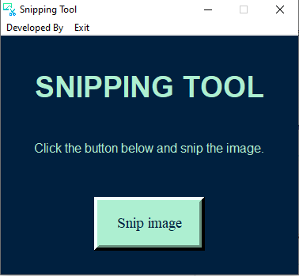
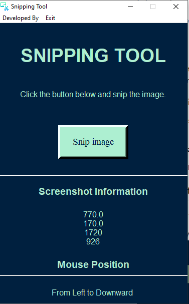

# Snipping Tool with Python
### Installation
1) **Install Python** from https://www.python.org/downloads/
2) **Install Dependencies**
Open cmd in the folder Snipping Tool and run this command
```ruby
pip install -r requirements.txt
```
3) After installing the dependencies, run the py file **OR** write this command in cmd and enter
```ruby
python snipping.py
```
### Information
This Tool is developed using **Python**. Following are the libraries used:
1) **Tkinter**
2) **Pyautogui**

This tool allows the user to take a screenshot in the snipping style and it will display the coordinates information along with the mouse position.

### Executable File in Release
The .exe for the snipping tool can be found in the release section which can be downloaded and can easily be used by anyone.

**The snipped imaged will be saved in the same folder with name Capture_{current date and time}.png**

The Tool is developed by [Muhammad Osama](https://www.flowcode.com/page/osamayousuf)

## Screenshots



